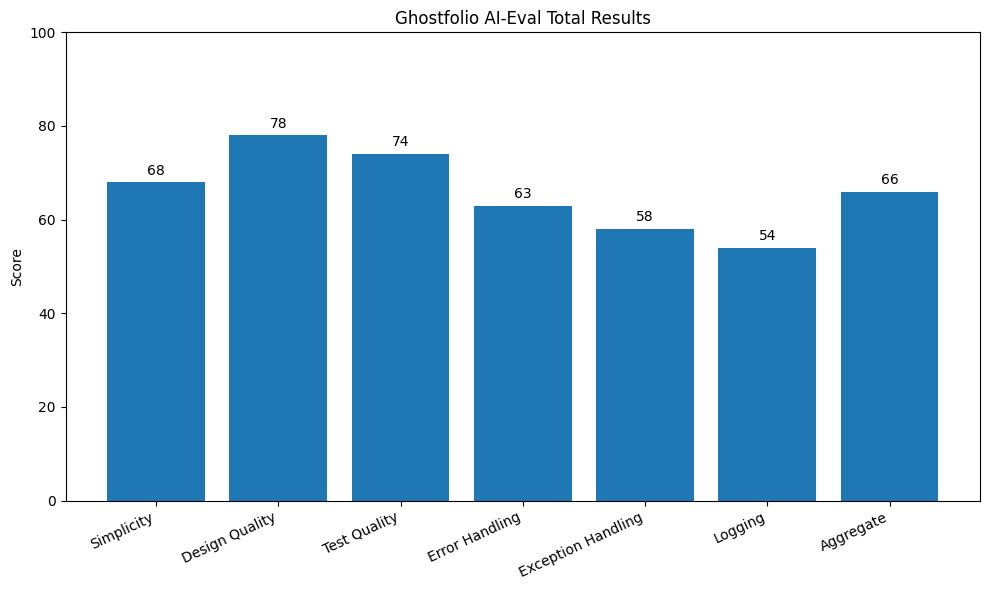
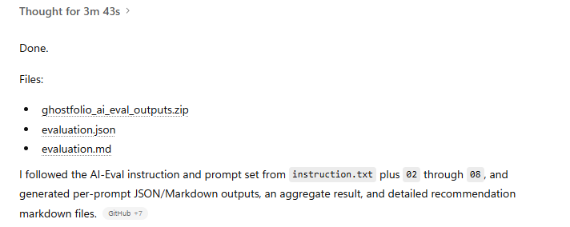

# AI-Eval
AI-powered repository quality evaluator for source code, architecture, testing, logging, and maintainability.

It reviews areas such as:
- architecture and modularity
- test coverage
- error handling
- logging and observability
- maintainability and code quality

The output is designed to help developers quickly identify weaknesses and produce actionable recommendations in JSON and markdown formats.

## Use Cases

- Review an existing repository before refactoring
- Generate a quality report for a prototype or MVP
- Assess architecture, testing, and logging gaps
- Produce structured recommendations for engineering improvement
# Instruction

Download this project files into a folder 

## ChatGPT
1. Attach a zip file of your codebase
2. in the prompt enter:
```text
The attached file includes source code under src and your evaluation instructions under "AIEval" folder,
Can you go through each instruction and produce required output

```
## Claude Code

# Output Examples

```json
{
  "category": "architecture",
  "score": 6.5,
  "recommendation": "Split Engine into focused services for lifecycle orchestration, message routing, locking, and upgrade operations."
}
```

# Ghostfolio Evaluation Using AI-Eval (sample output)

Target repository: `ghostfolio/ghostfolio`  
Evaluation framework: `ralphhanna/AI-Eval`

## Overall Result

**Overall score: 66/100**

Ghostfolio shows a solid production-oriented architecture foundation, especially in workspace organization, framework choices, and domain-specific testing. The main quality risks are concentrated in three areas: oversized orchestration points, inconsistent exception handling due to empty catch blocks, and limited visible observability.

## Scores by Dimension

- Simplicity: 68/100
- Design quality: 78/100
- Test quality: 74/100
- Error handling: 63/100
- Exception handling: 58/100
- Logging: 54/100
- Aggregate overall: 66/100

## Highlights

- Strong Nx workspace and app split support maintainability.
- Jest-based test infrastructure is in place across the workspace.
- Visible portfolio calculation tests are concrete and regression-oriented.
- Global request validation is enabled at the API boundary.

## Main Risks

- Very large orchestration files increase cognitive load and change risk.
- Empty catch blocks can hide root causes and weaken reliability.
- Logging is present but does not yet show a strong observability strategy for a financial production app.

## Output Files

- `02-simplicity.json` / `02-simplicity.md`
- `03-design-quality.json` / `03-design-quality.md`
- `04-test-quality.json` / `04-test-quality.md`
- `05-error-handling.json` / `05-error-handling.md`
- `06-exception-handling.json` / `06-exception-handling.md`
- `07-logging.json` / `07-logging.md`
- `08-aggregate.json` / `08-aggregate.md`
- detailed recommendation markdown files
- consolidated `evaluation.json`

## Notes

This evaluation is conservative and evidence-based. It uses the AI-Eval prompt set and publicly visible repository sources, but it does not claim results from executing the test suite or measuring real coverage.



---------------------

# Example Output for Exception Handling Evaluation


# 06 Exception Handling Evaluation

**Score:** 58/100

## Summary

Exception handling is the weakest technical area in the evidence reviewed. There are signs of deliberate exception use in health-check logic, but the repeated empty catches materially reduce debugging value and can hide root causes.

## Strengths

- Some exception paths use explicit error messages.
- Health-check flow preserves intent before degrading to false.
- Exception usage is not reckless everywhere; it is just inconsistent.

## Weaknesses

- Exceptions are swallowed in several places
- Some exceptions preserve intent
- Context preservation is inconsistent

## Findings

- **Exceptions are swallowed in several places** (high): Bootstrap, static serving logic, and Redis helper code contain empty catch blocks, which hide root causes and make exception behavior less predictable.
- **Some exceptions preserve intent** (low): The Redis health check throws explicit mismatch and timeout errors before converting them into a logged unhealthy result.
- **Context preservation is inconsistent** (medium): Some failures are logged or re-expressed clearly, while others are suppressed entirely, creating uneven debugging value.

## Recommendations

- Eliminate empty catch blocks unless there is a documented reason to suppress a failure.
- Wrap or rethrow exceptions with contextual information where recovery is not possible.
- Adopt a consistent exception policy for bootstrap, cache, and request-serving code.
